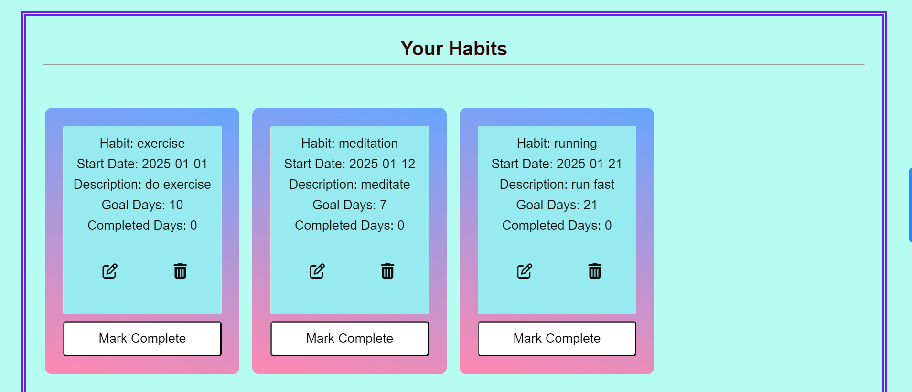
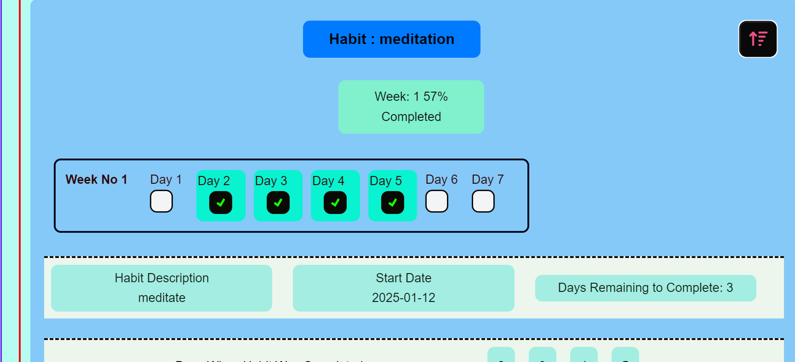
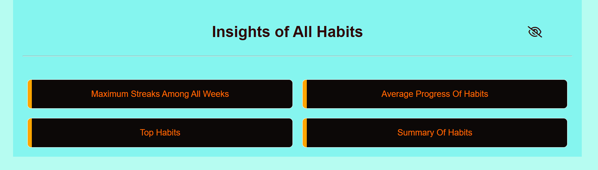
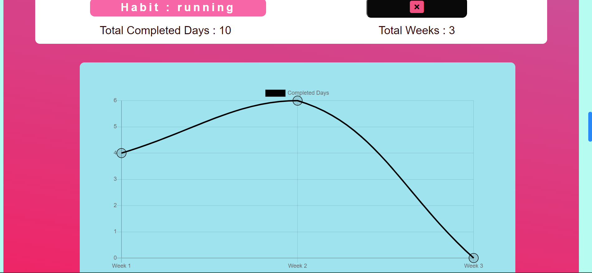
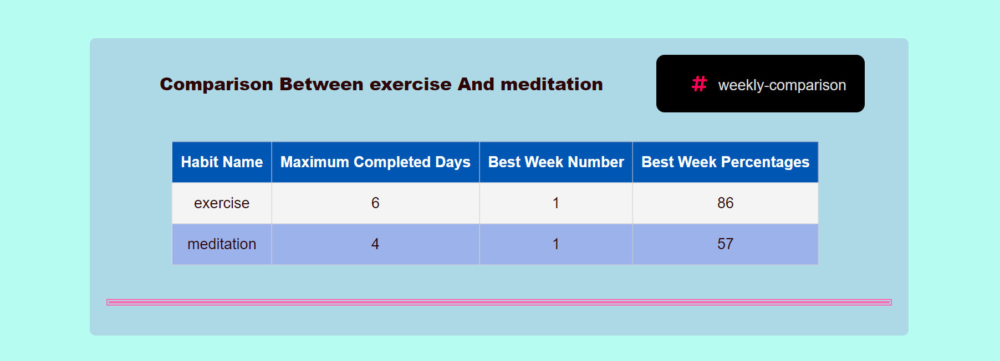

# Habit Tracking System

## Description

The Habit Tracking System is a dynamic and intuitive web application designed to assist users in building and maintaining productive habits. It leverages modern web development practices and intermediate JavaScript concepts to create a seamless and engaging user experience.

### Motivation

This project was inspired by the need to simplify habit tracking, promote self-discipline, and encourage positive behavioral changes. By combining intuitive design and powerful features, the Habit Tracking System addresses the challenges faced by individuals striving for consistency in their routines.

### Why This Project?

The Habit Tracking System was built to solve the problem of habit management, making it easy for users to track, analyze, and improve their daily practices. Additionally, this project provided an opportunity to master key JavaScript skills and enhance my web development expertise.

### What Problem Does It Solve?

- Provides a single platform to manage and organize multiple habits.
- Tracks weekly progress and offers visual feedback through detailed charts.
- Enables users to compare habits, offering valuable insights into their routines.
- Stores data persistently using local storage, ensuring user information is not lost.

### What Did I Learn?

- **DOM Manipulation**: Efficiently updating and interacting with webpage elements.
- **Arrays and Objects**: Managing data structures effectively.
- **Local Storage**: Utilizing browser storage to provide a robust and seamless experience.
- **Fetch API and Promises**: Handling API requests and managing asynchronous data.
- **IIFE (Immediately Invoked Function Expression)**: Executing functions immediately to initialize data or bind events.

### What Makes This Project Stand Out?

- Engaging user interface with seamless navigation powered by Bootstrap.
- Comprehensive insights into habits, including charts and comparison sections.
- Intuitive icons and dynamic weekly containers for a personalized experience.
- The ability to compare habits and analyze their performance in-depth.
- Future scalability to incorporate reminders and streak tracking features.

## Features

### Manage Habits
Add, edit, and delete habits effortlessly to maintain a clear and organized list.

---

### Weekly Progress Tracking
Use weekly checkboxes to monitor your progress and mark completed days.

---

### Detailed Insights
Get in-depth insights about your habits with interactive visual elements.

---

### Visual Performance Charts
View weekly charts showing habit performance and total completed days.

---

### Habit Comparison
Compare habits using filtering options to gain deeper insights.

---

## Challenges

### Challenges Faced
- **Data Management**: Efficiently managing user data for multiple habits.
- **Dynamic Elements**: Creating interactive and visually appealing components.
- **Integration**: Handling asynchronous operations and Fetch API.
